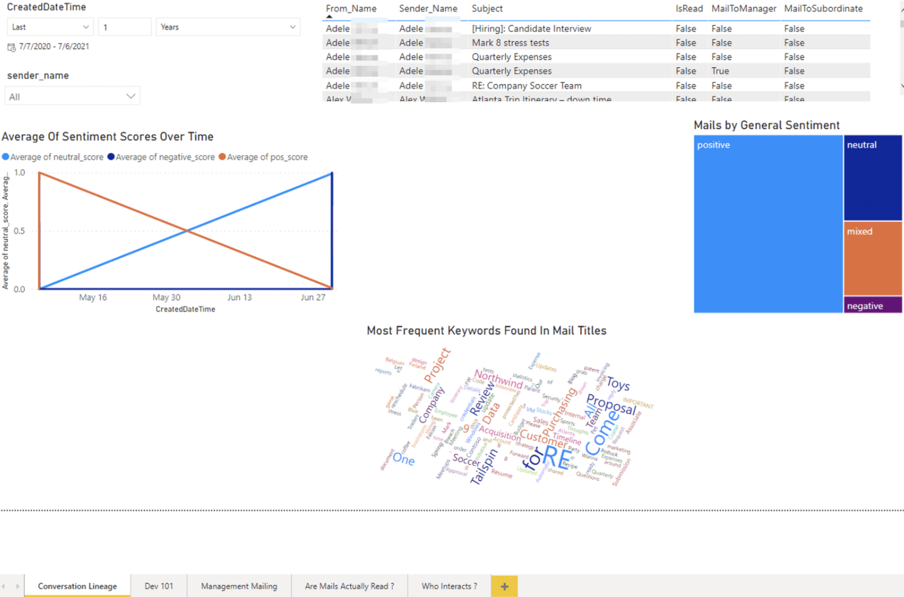
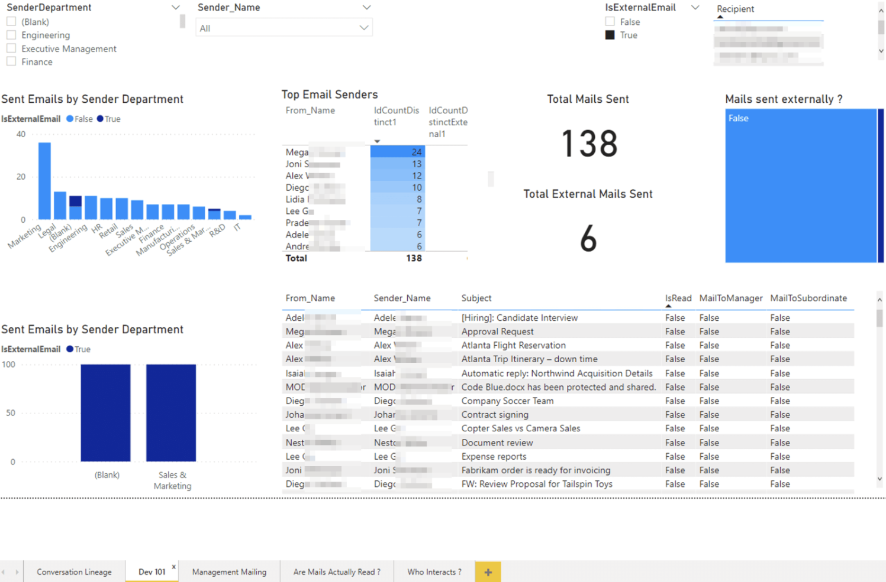
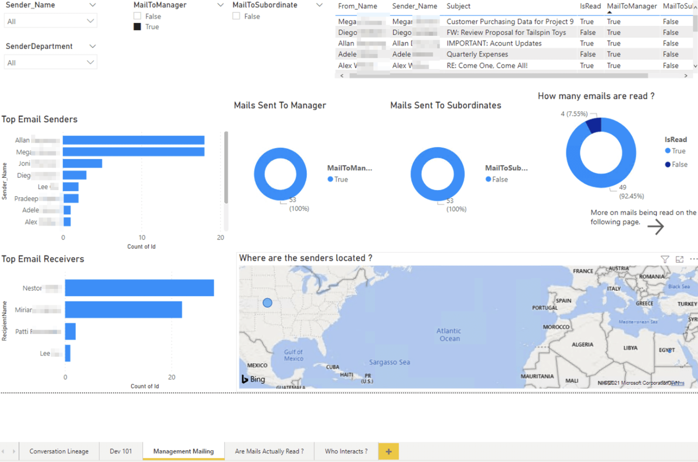
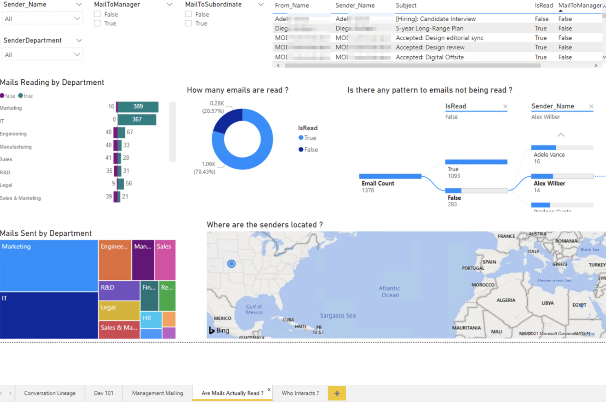
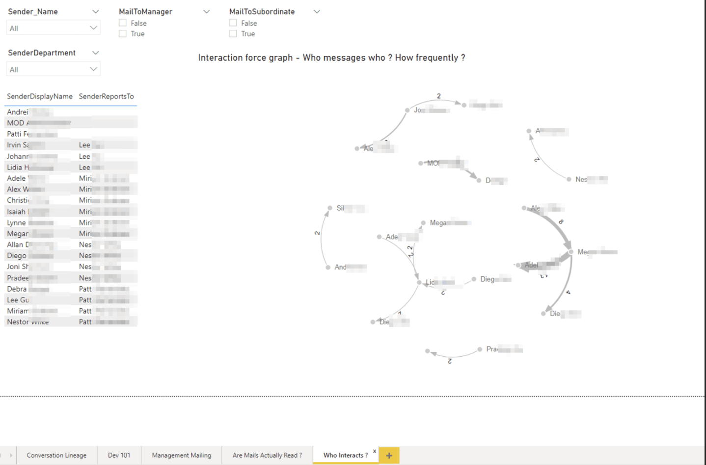

# Conversation Lineage Template

[Get Started](https://github.com/microsoftgraph/dataconnect-solutions/tree/main/solutions/conversation-lineage)

## Business Summary 
Use the Conversation Lineage template to gain insights into an organization's communication patterns by analyzing Microsoft 365 data with Microsoft Graph Data Connect (MGDC). 
This template will teach you the key steps and Azure technologies required to build your own MGDC based application. You will extract and process Microsoft 365 data and run analytics on top of it using Azure Synapse Analytics, you will process both historical data and future data daily using Azure Synapse triggers. You will extract sentiment and Natural Language Processing (NLP) entities from conversations using Azure Cognitive Services and will visualize key insights using PowerBI. 

## Key use cases 
- Integrate Microsoft 365 email conversations with CRM or Ticketing information to create a single view with customer sentiment analysis.  
- Leverage the power of conversation patterns to optimize efficient routing. 
- Craft compelling internal email campaigns with proven results.  
- Identify and eliminate bad communication practices
- Measure changes in an organization’s communication patterns. 
- Reduce redirecting by determining the value each party brings to the chain of the interaction. 
- Track if emails are being read and shared using sentiment analysis to gauge reactions. 
- Get a view of the communications sentiment over time.  
- Find the most frequent keywords found in main titles. 
- Get a view of all your emails sent by each department, your top email senders, the total of emails sent, and the count of emails sent externally. 

## MGDC data sets 
- Azure Active Directory Users **(BasicDataSet_v0.User_v1)** 
- Teams Chats **(BasicDataSet_v0.TeamChat_v1)** 
- Outlook Emails **(BasicDataSet_v0.Message_v1)** 
- Outlook Calendar **(BasicDataSet_v0.CalendarView_v0)** 

## PowerBI Dashboards 
The **Global Conversation Lineage** dashboard shows overall general sentiment, frequent keywords, and interaction type.

The **Dev 101** report helps you understand the emails sent by each department, your top email senders, the total of emails sent, and the count of emails sent externally. 

 
The **Mailing Management** report gives you a view of the top email senders and receivers, all the emails sent to managers and subordinates, it will show you how many emails are read and where the senders are located.  

With the **are mails actually read** report you can understand the number of mails read by department, how many emails are read, if there are any pattern to emails not being read, the senders name and location. 

With the **Who interacts with whom?** you can understand the interaction between teams and how frequently those interactions are occurring with each sender. 
