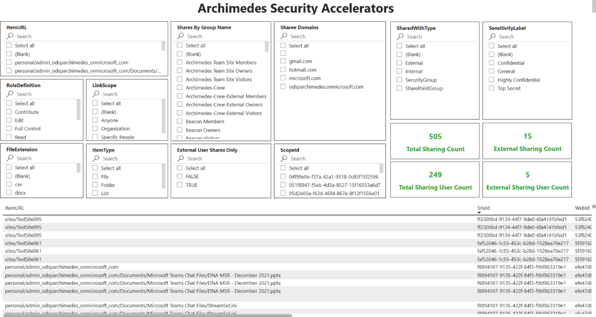
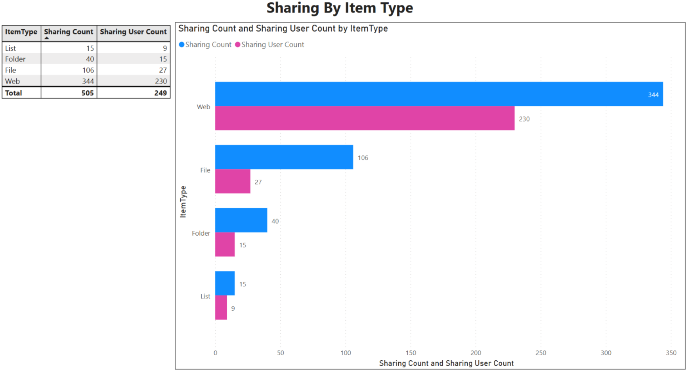
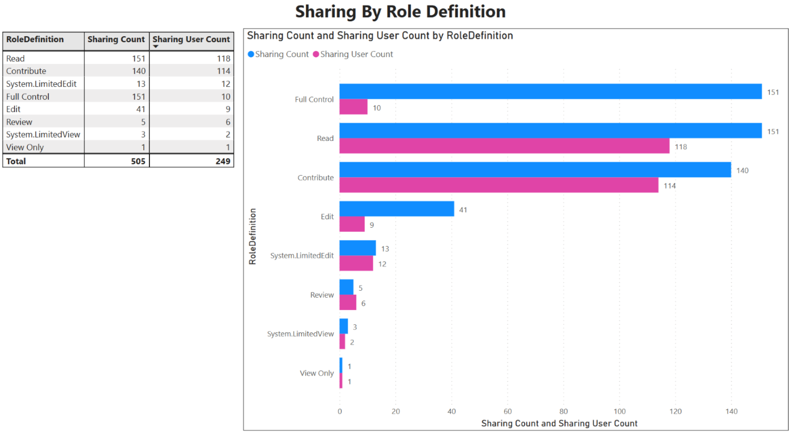
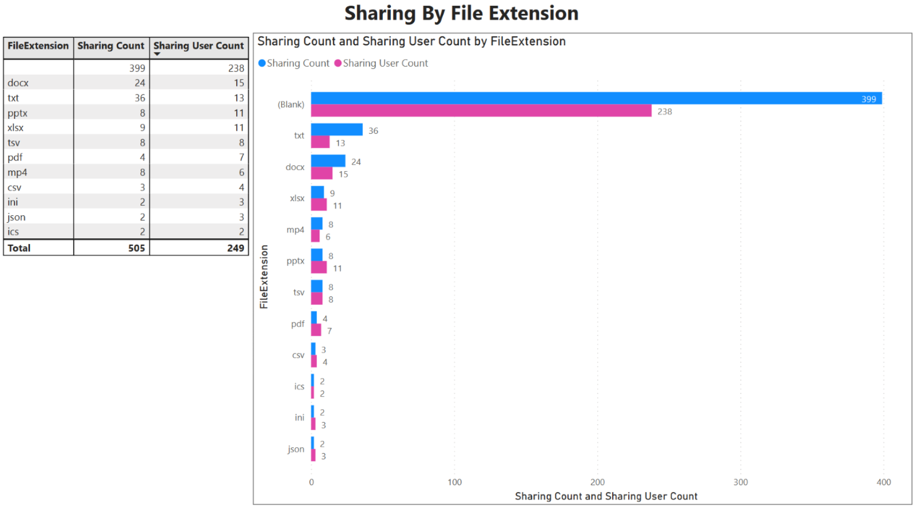
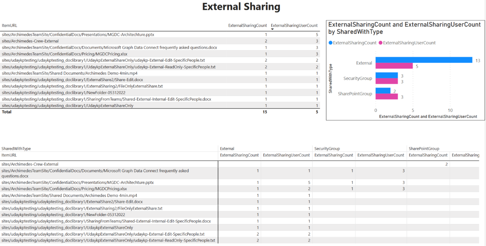

# Information Oversharing Template 

[Get Started](https://github.com/microsoftgraph/dataconnect-solutions/tree/main/solutions/information-oversharing)
 

## Business Summary 
Information oversharing is a security and compliance use case powered by our newly available SharePoint datasets. This template helps you validate if sensitive data was mistakenly leaked or if employees intentionally shared confidential information with malicious intent. 

## Key use cases 
- Monitor the sharing landscape and craft customer tenant policies.  
- Protect confidential client data, maintain constant compliance.  
- Scale your ML model with the increased volume of email data.  
- Understand risky behaviors and usage and promote employee behaviors.  
- Monthly tenant policy adoption report and month over month sharing trends report.  
- Identify malicious actors and protect confidential data.  
- Set terms to watch for leakage, categorize and assign severity levels.  
- Allow customers to better understand how secure your SharePoint is. 
- Maintain information boundaries. 
- Establish new rules based on how sensitive data is managed and classified. 
 

## MGDC data sets  
- Microsoft Groups **(BasicDataSet_v0.GroupMembers_v0)** 
- Microsoft Groups **(BasicDataSet_v0.GroupDetails_v0)** 
- Microsoft Groups **(BasicDataSet_v0.GroupOwners_v0)** 
- OneDrive and SharePoint Online **(DocumentSharingDataset_v0_Preview)**
- OneDrive and SharePoint Online **(SharePointSitesDataset_v0_Preview)**
- OneDrive and SharePoint Online **(SharePointGroupsDataset_v0_Preview)**

## PowerBI Dashboard 

**Sharing details**  

**Sharing by item type**

**Sharing by role definition**

**Sharing by file extension**

**External sharing**

