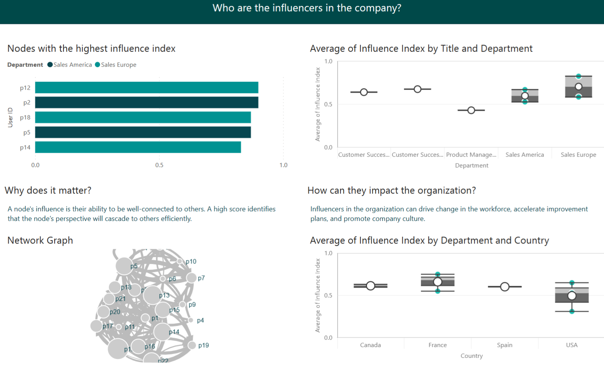
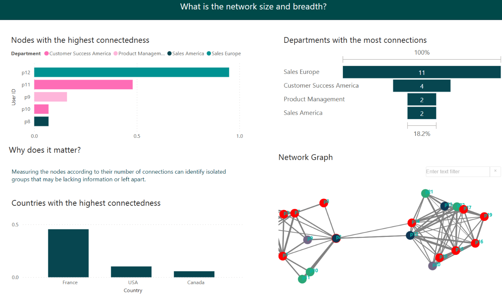
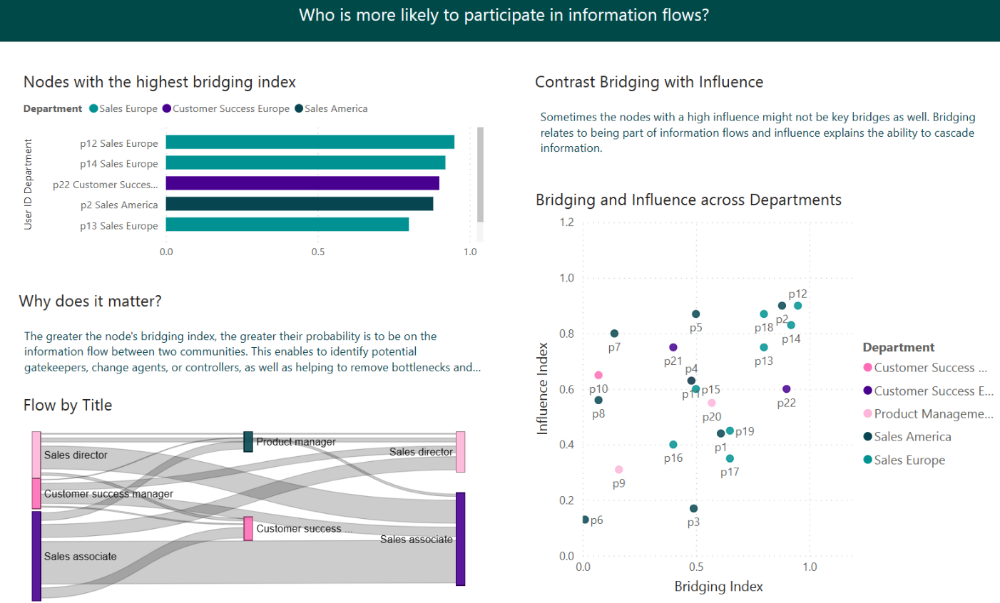

# Organizational Network Analysis Template 

[Get Started](https://github.com/microsoftgraph/dataconnect-solutions/tree/main/solutions/ona)

## Business Summary 
The purpose of ONA (Organizational Network Analysis) is to harness information flows and team connectivity to unlock productivity, innovation, employee engagement and organizational change. This solution template enables customers to leverage ONA metrics from M365 data and analyze the networks within. 

## MGDC data sets 
- Azure Active Directory Users **(BasicDataSet_v0.User_v1)**
- Teams Chats **(BasicDataSet_v0.TeamChat_v1)** 
- Outlook Emails **(BasicDataSet_v0.Message_v1)** 
- Outlook Calendar **(BasicDataSet_v0.CalendarView_v0)** 

## Key use cases 
- Harness information flows and team connectivity to unlock productivity, innovation, employee engagement and organizational change.  
- Evaluate information flows capturing the betweenness of nodes and their probability to be on the information flow between two people.  
- Identify potential gatekeepers, change agents, or controllers to remove bottlenecks. 
- Explore influential connections measuring the influence of nodes as being well-connected to others. A high score identifies that the node’s perspective will cascade to others efficiently. 
- Empower inclusive networks ranking the nodes based on their number of connections to identify isolated groups that may be lacking information or left apart. 
- Increase ROI: measure the impact of organizational shifts.  
- Improve organizational efficiency.  
- Predict business outcomes and analyze trends.  
- Understand your team's connectivity 

## PowerBI Dashboard 

**Overview Page**  
From the Overview page, you can start analyzing the network graph created from the interactions of the M365 communication data, understand the flow of interactions between departments, have a glance at the raw data populating the graphs, and evaluate the number of connections and interactions of the nodes. There are date and flag filters available for comparison. 

Each node is a person. If a node interacts with another node, then they become a connection. An interaction can be either of the following: 

- One email with 5 or less recipients 
- One meeting of 5 or less attendees 
- Eight chat messages (each with 5 or less recipients) 
 
This blend of interactions is informed by investigations from Microsoft Research (MSR) using statistical insights from US-based Microsoft employees. The two flags available to classify the nodes are the following and can be configured using parameters: 

- Bridge flag: Top 15 percentile bridging index 
- Degree flag: Top 15 percentile degree index 

**Node Analysis Page**  
The Node Analysis page provides additional drill-down information of the interactions in the organization and insights on how people prefer to communicate. 

**Influence Analysis Page**  
Explore influential connections: Measures the influence of nodes as being well-connected to others. This is based on the PageRank of the graph. A high score identifies that the node’s perspective will cascade to others efficiently. How to engage: 

- Identify influencers 
- Explore the profile of the influencers: Title, Department, Country 
- Compare period vs period to analyze consistency 

**Network Size and Breadth Page**  
Empower inclusive networks: Rank the nodes based on their number of connections to identify isolated groups that may be lacking information or left apart. 

- Identify siloes and communities that may not be interacting the most.
- Compare period vs period to analyze consistency.

**Bridging Analysis Page**  
Evaluate information flow: Measures the connectivity of nodes to detected graph communities. First, graph communities are discovered using LPA (label propagation algorithm). Then, we count how many communities a node is connected to and normalize by the total number of communities. A node connected to no communities will be 0. A node connected to all communities with be 1. 

- Identify key bridges and their departments 
- Analyze the correlation of bridging and influence

