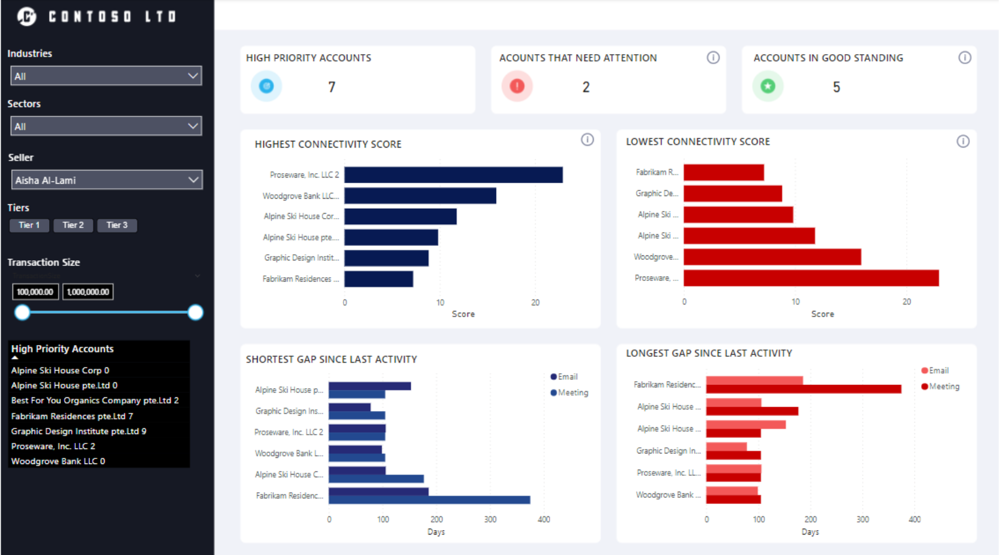
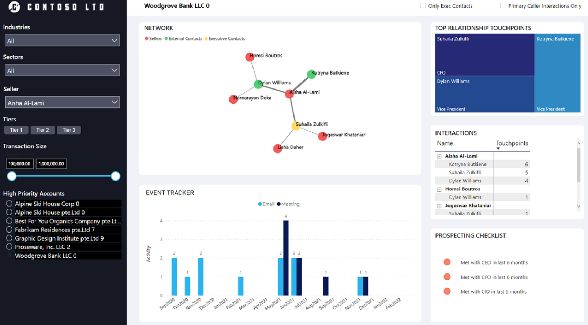

# Relationship Mesh Template 

[Get Started](https://github.com/microsoft/Relationship-Mesh-Solution-Accelerator-with-MGDC-and-Azure-Synapse-Analytics)
 
## Business Summary 
Building strong relationships with customers is especially important to improve customer retention, loyalty, and revenue. Gaining insights into the strength of relationships with customers and their key contacts will enable your teams to take required actions to manage and improve the interactions at various stages in a customer engagement life cycle. 

This template enables you to create a Relationship Mesh Solution that shows how well your sales team is connected to your key accounts and how they interact with each contact at each account. 
 
## Key use cases 
- Integrate customer/seller relationship data from various systems together into a single view with actionable insights at the area and individual account level.  
- Minimize customer churn, increase loyalty, and generate more revenue in every account.  
- Programmatically manage and improve customer interactions at each stage of the sales cycle. 
- Get visibility into your accounts and establish clear next steps. 
- Define ruleset to calculate the connectivity score between internal and external contacts.  
- Gain timely analytics and insights that help improve relationships between sellers with high priority accounts. 
- Establish a detailed view of relationship event tracking and a checklist to make it actionable.  

## MGDC data sets 
- Outlook Emails **(BasicDataSet_v0.Message_v1)** 
- Outlook Calendar **(BasicDataSet_v0.CalendarView_v0)** 

## CRM data:  
- Contacts 
- Accounts 
- Opportunities  
- Employees 

 
## PowerBI Dashboards 
With the prepackaged business logic, you can calculate connectivity scores between your sellers and customer contacts based on CRM, email communication and meeting data. This dashboard shows you a summary of all high priority accounts, their connectivity scores, it includes the accounts that need attention, the accounts in good standing and the shortest and longest gap since the last activity.

With the prepackaged business logic, you can calculate connectivity scores between your sellers and customer contacts based on CRM, email communication and meeting data. This dashboard shows you a summary of all high priority accounts, their connectivity scores, it includes the accounts that need attention, the accounts in good standing and the shortest and longest gap since the last activity.

The **detail dashboard** includes actionable insights both at organizational level and at an individual account level, you can refine your search by the industries, sectors, sellers, tiers and transaction size, it will show you the network of sellers and external contacts, the top contacts at an account, the top relationship touchpoints , the interactions, an event tracker and the list of prospecting checklist. 

