# Skills finder and Talent Alignment Template 

[Get Started](https://github.com/microsoftgraph/dataconnect-solutions/tree/main/solutions/projectstaffing)
 
## Business Summary 
The Skills finder and talent alignment application is a Microsoft Graph Data Connect (MGDC) based solution which allows engagement managers to build the best suited teams for projects, by finding employees that are available and have the best set of skills for the project, as well as the most relevant set of potential skills. 
 
The application processes employee profile and email data from Microsoft Graph Data Connect and complementary data sources, using Azure Data Factory (ADF). It uses this data to build a model based on which, given queries containing desired skills or topics of interest, the most relevant employees are recommended. For each employee, information from their profile is provided, along with inferred information about their potential skills, topics of interest or roles. 
The application's search rules are also highly customizable, allowing users to tailor configurations regarding data sources, filters, and search criteria, to best suit their needs. 

## Key use cases 
- Locate subject matter expertise to form teams with the right mix of skills and availability.  
- Enrich HR (Human Resources) data with M365 to get insights about skill, capability level, and talent portfolio.  
- Dynamically identify and surface changes in subject matter expertise based on digital exhaust. 
- Get indication of availability and expertise to staff critical projects and high value positions. 
- Leverage analytics to develop data-driven talent strategy and retain / grow your talent over time. 
- Search for relevant employees (by name, by skills & availability or by availability alone) 
- Get relevant information about each recommended employee (employee profile information and inferred information). 
- Provide job opportunities with great skill fit to boost employee satisfaction and retention. 
- Define new teams (creating, adding members, removing members, and exporting team members. 

## MGDC data sets 
- Azure Active Directory Users **(BasicDataSet_v0.User_v1)**
- Azure Active Directory Managers **(BasicDataSet_v0.Managers)**
- Outlook Emails **(BasicDataSet_v0.Message_v1)** 

## Human Resources data:  

- Employee profiles (derived from the systems used in the HR department). 

## PowerBI Dashboard 

**Searching for relevant employees**

Users can search for employees best matching a provided list of search terms. The terms represent skills, responsibilities, technologies, etc. that have been matched or inferred for each employee, based on the provided data sources. 

An example of how a search is performed from the application UI is shown in the image below: 
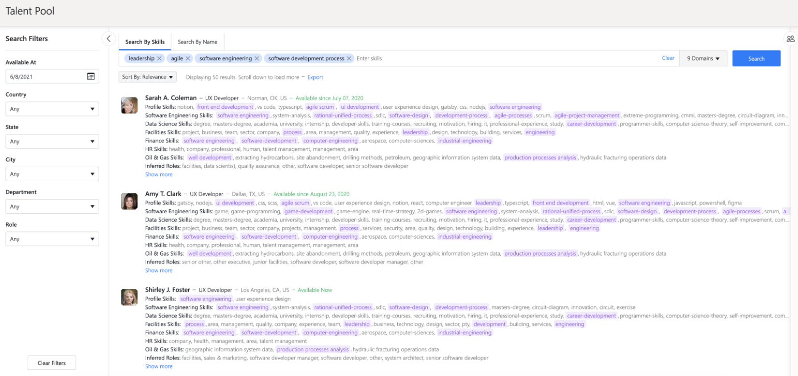

**Searching by availability only** 

The user can search for employees without providing any search terms, while setting only the availability filter. When clicking the "Available At" field in the filters section, a calendar view will appear. The user can select from there the date starting from which recommended employees must be available. The results are sorted by availability in ascending order (the ones available effective immediately first), and for identical dates, the results are also sorted alphabetically by name. 
An example of how a search is performed from the application UI is shown in the image below: 
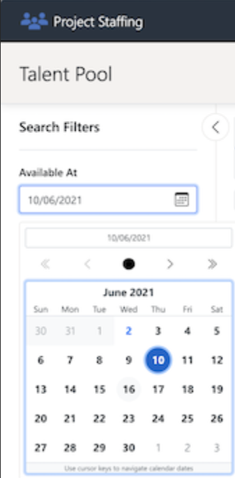

**Searching by skills and availability** 
The user can search for relevant employees and use the availability filter at the same time. In the recommendations list all the employees have the availability date before or on the date set in the availability filter. This is easier to see when sorting the recommendations by availability. 
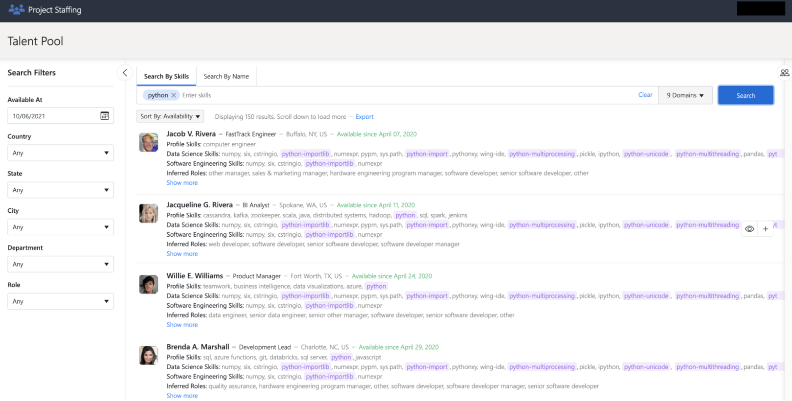

**Searching by name** 
The application also has the option of searching by name. The name does not have to be complete. The user can search by first name, middle name, last name, full name etc.
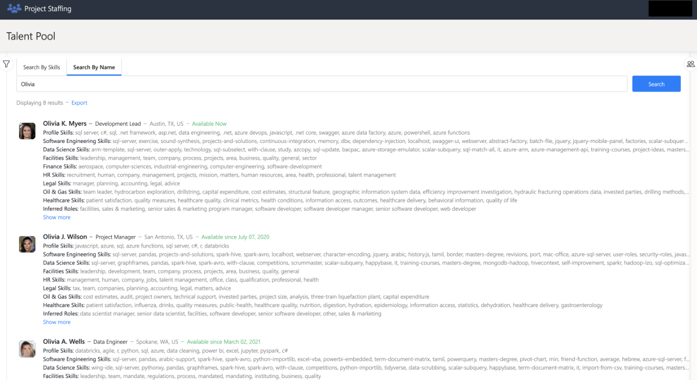

**Employee profile information** 
To see more information about an employee from the employee recommendation list or from the team list: 

- Hover over a specific employee in one of these lists 
- A button with an eye symbol on it will appear on the right side of the employee record 
- Click the button 
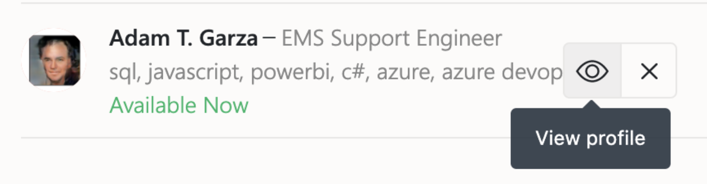

A pop-up containing the employee profile will appear, as shown in the image below: 
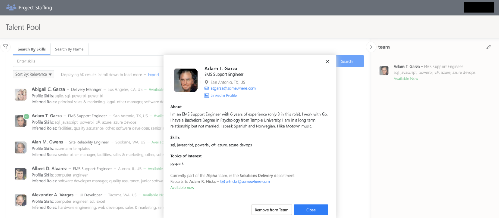

**Inferred information** 
By processing the employee profile and email data together with known term correlations from various supported domains, the employee profiles are enriched with inferred data. 
This allows users of the application to find not only employees which explicitly possess a set of skills or interests, but also the ones which are likely to possess them, or the ones that have the potential to easily learn the desired skills, because they already have a wide range of related abilities. 
The inferred skills and interests are derived from specific domains (taxonomies) and are grouped and displayed as such. 
Aside from this, the application also infers which roles are well suited for a recommended person. 
Below is an example of a list with 3 employees where the roles inferred are underlined. 
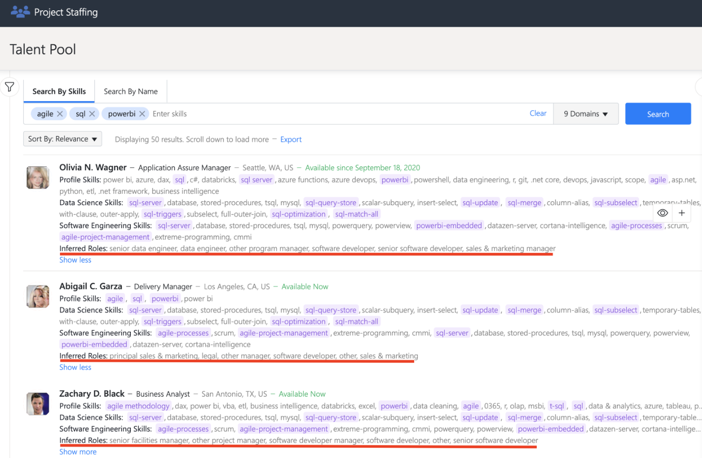

**Search results filtering and sorting** 

The user can use filters to narrow down the search to the employees that match best the wanted characteristics. The search filters can be seen after clicking the icon to the left of the search bar, as shown in the image below. 
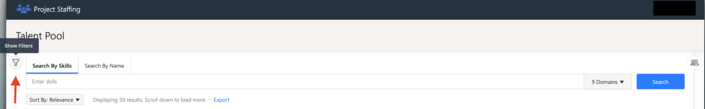

For each filter, the application will present the total list of value options, as shown in the example below.

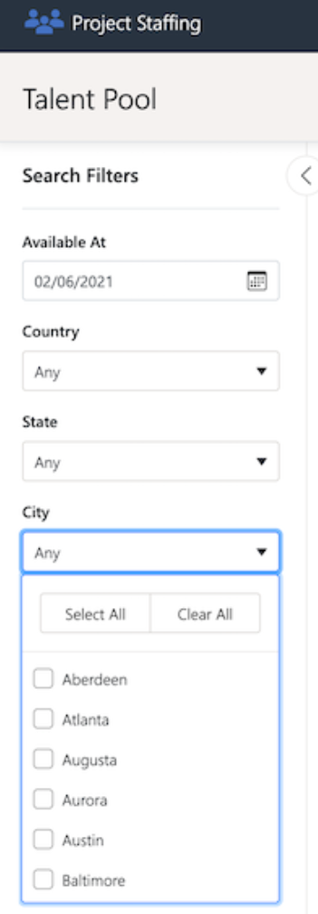

The search results can be sorted by relevance, in this case the search criteria and email search settings dictate the exact order of the recommendations. 
The other sorting option is by availability. This means that not the employees that match the query best are shown first, but in ascending order of the dates from which they are available to join a new project. The ones that do not have an explicit availability date defined (regarded as available effective immediately) are displayed first. 
The sorting option is below the search bar, as shown in the image below. 
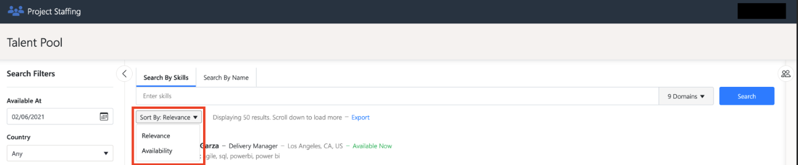

**Search term autocomplete and related terms suggestions** 

As the user begins writing search terms in the search bar, the application displays multiple suggestions of known search terms, prefixed with the string the user wrote so far. 
This happens after a short delay from the last keystroke, until the current term is submitted by pressing "Enter". For certain suggested words, the application can also display a list of related term suggestions, as shown in the image below. 
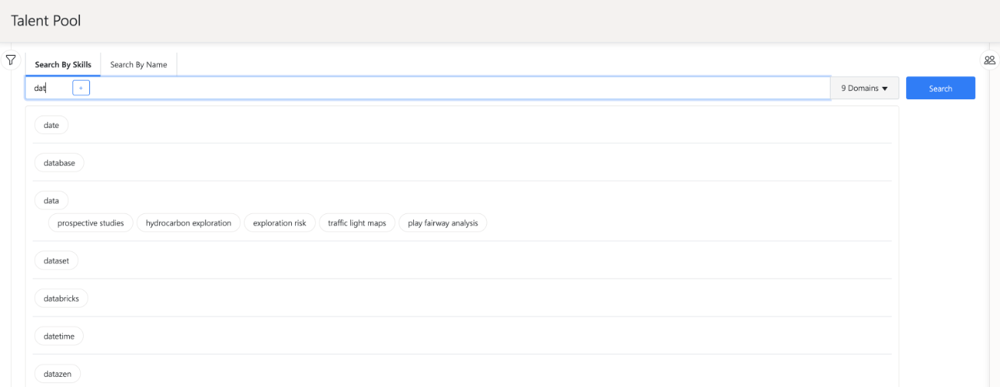

**Using search domains for skills inference and search results matching**

The application supports searching in multiple domains e.g., Software Engineering, Data Science, Healthcare, Oil & Gas etc. The search operation has the option of enabling only the domains that are of interest to the user. The inferred skills differ depending on which domains are enabled. 

For example, if a search is made using the term sensor and having the 'Healthcare' domain enabled the recommendations are as follows: 
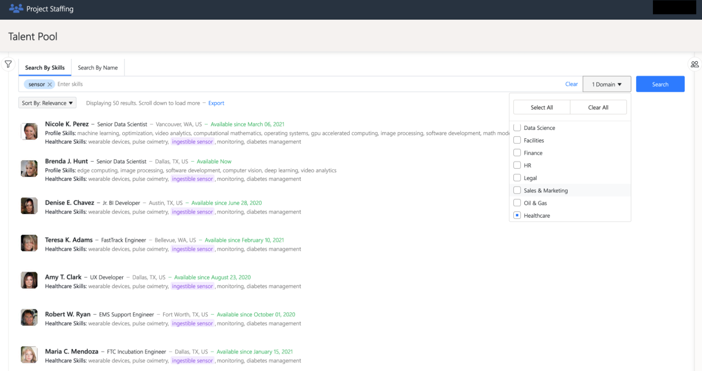

If we do the same search but this time with the 'Software Engineering' domain enabled, we will see that the skills inferred will differ. 
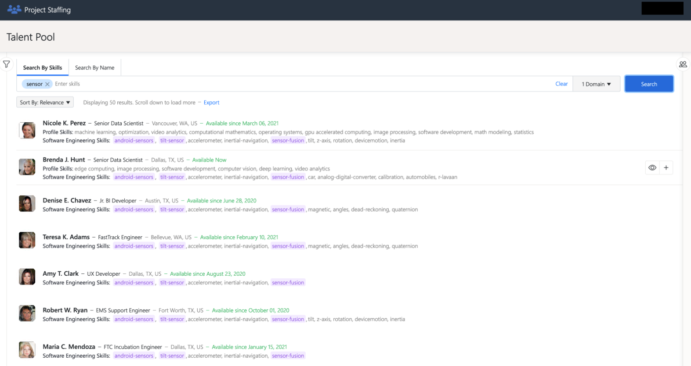

**Exporting search results**

The results of a search operation can be exported into a file with excel or CVS format. To do this, the user must click on the highlighted Export word right under the search bar, as presented in the image below. After that, a pop-up will appear where the user can configure the file name, format, and number of results to export. Only the results pages retrieved so far will be exported. 
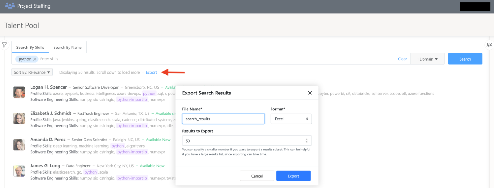

**Defining teams** 

To view the team features, click the icon to the right of the Search button, as shown in the image below. 
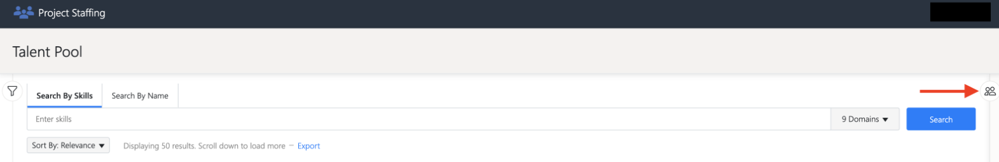

**Creating a team** 

To create a new team, click the 'Create team' button, a pop-up will appear where the user can add the name and description of the team, as shown in the image below. 
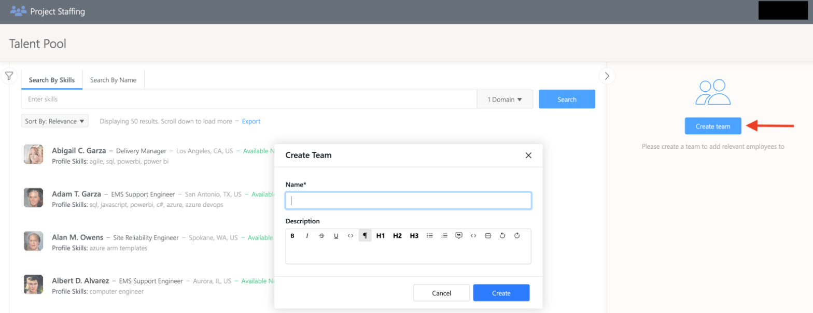

**Adding members to the team** 

To add an employee to the team, hover over the wanted employee from the list of employees. A plus button will appear on the right side of the employee record. Click the plus button. 

**Removing members from the team** 

To remove an employee from the team, hover over the wanted employee from the list of team members. A button marked with x will appear on the right side of the employee description. Click the button. 
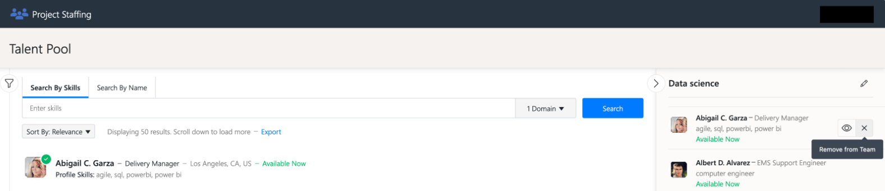

**Exporting team members** 

The team members can be exported into an excel or csv file. To do this, the user must click the Export button at the bottom of the team members list. A pop-up will appear from where the name and format of the file can be configured, as shown in the image below. 
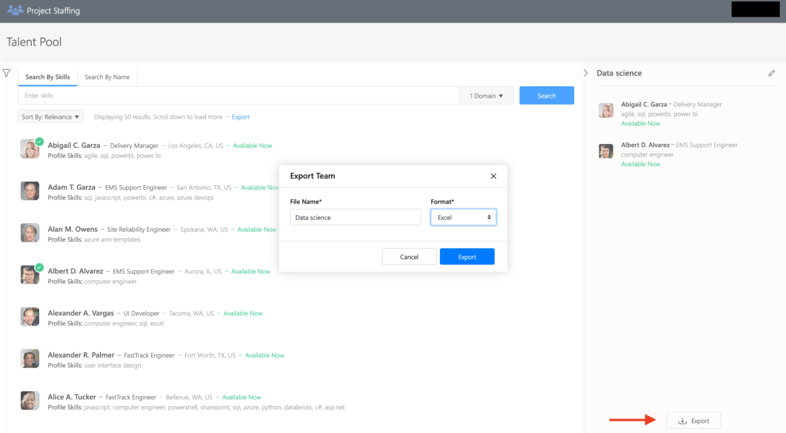